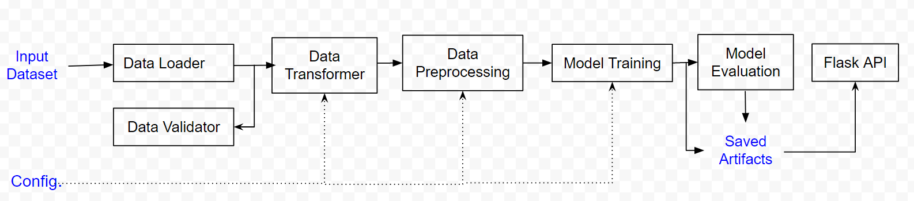

# Linear Regression Model 

## Introduction

Linear regression model module with model training using Statititical Gradient Descent (SGD) or Gradient Descent. 

## Installation 
You can find installation files in the dist directory.

## System Overview

The below diagram shows an overview of the pipeline. Detailed explanations of each component is included next.



### Data Loader

The input data Diabetes dataset from sklearn datasets. This modeule reads the data.

### Data Validator

Validates if the input data is present and in the correct format. 
This part has been implemented using assertions in the data loader module and unittests. But, in an enterprise system with multiple data sources this should be a standalone module.

### Data Transformer

Includes data wrangling and feature engineering. For this project this module keeps the third feature in the dataset and reshapes the data. In a bigger project there would be seperate modeuls for data cleaning, data transformation and feature selection. 

### Data Preprocessing

Includes preprocessing steps required for model training. For this project this only splitting the data into training and test sets. But it could include feature scaling, one hot encoding or other required steps.

### Model Training

We use a Linear Regression model in this project. The user can choose the `learning rate`, `number of iterations` and `training mode`. For the `training mode` we have the option of `GD` (Gradient Descent) or `SGD` (Statistical Gradient Descent)
No hyper parameter optimization or cross validation is used, but in an enterprise pipeline we should include those steps.

The trained model is saved as a pickle file. Model object's `__predict` method can be called to make predictions.

### Model Evaluation

Evaluates model performance.

### API

The trained model is served as a Flask API. To create the API endpoint locally the user can run `main.py`
The API is also accible publically on "https://ksarafrazi.pythonanywhere.com". The API endpoints include:

#### "/model-check" :
Check model helath and information

#### "/stream" :
Returns prediction for a single input.

Sample API call
```
X = [0.06169621]
headers={'Content-type':'application/json'}
payload = {'data':json.dumps(X)}
y_predict = requests.post('https://ksarafrazi.pythonanywhere.com/stream', json=payload, headers=headers).json()
```

#### "/batch" :
Returns prediction for an array of inputs.

Sample API call
```
X = [[0.0616962065186885], [-0.0514740612388061], [0.0444512133365941]]
headers={'Content-type':'application/json'}
payload = {'data':json.dumps(X)}
y_predict = requests.post('https://ksarafrazi.pythonanywhere.com/batch', json=payload, headers=headers).json()
```

